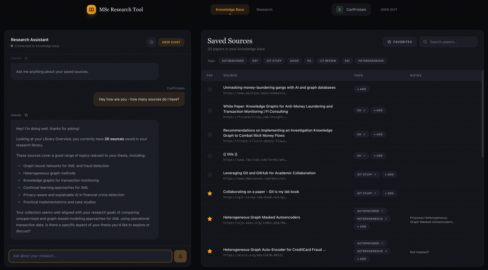

# AI Thesis Research Platform

A custom research assistant I built for my MSc. Used to find, organize, and chat with research papers.



---


---

## What is it?
It's a full-stack web app that combines:
1.  **Exa AI**: To search for high-quality academic papers.
2.  **RAG Pipeline**: To save papers and index them using embeddings.
3.  **Anthropic API**: To chat with my saved papers for summaries and writing paragraphs.

## Tech Stack
*   **Frontend**: React (Vite) + Tailwind + Axios
*   **Backend**: Python (FastAPI) + Clean Architecture
*   **Database**: MongoDB (Metadata) + Local Vector Store (Embeddings)

## Setup

### Prerequisites
- [Docker](https://docs.docker.com/get-docker/) and Docker Compose
- [Anthropic API key](https://console.anthropic.com/)
- [Exa API key](https://exa.ai/)

### Installation
1. Clone the repo:
   ```bash
   git clone https://github.com/yourusername/ai-thesis-research-platform.git
   cd ai-thesis-research-platform
   ```

2. Create your environment file:
   ```bash
   cp backend/.env.example backend/.env
   ```

3. Generate a secret key and add it to `backend/.env`:
   ```bash
   python3 -c "import secrets; print(secrets.token_hex(32))"
   ```

4. Add your API keys to `backend/.env`

5. Run it:
   ```bash
   docker-compose up --build
   ```

6. Open http://localhost:5173